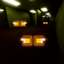

# Eyes in the Shadows mod for Minecraft Forge 1.7.10

## Pre-alpha, eyes don't spawn naturally, poison effect not applied on jumpscare, expect bugs too

The barrier between the world of the living and the world of the dead is already thin in the Minecraft lands.
The days as Halloween draws closer, it weakens down even further.

If you see the eyes, don't turn away from them.
 
 
Or do, at your own risk.
 
You have been warned.

## Dependencies

* [UniMixins](https://modrinth.com/mod/unimixins) (, , ) is a required dependency.
<!--* [CarbonConfig](https://modrinth.com/mod/carbon-config) (, , ) is a required dependency.-->

## FAQ
### What is this?
It is a backport of the [Eyes in the Darkness](https://github.com/gigaherz/EyesInTheDarkness/blob/master/LICENSE.txt) mod, originally created by [gigaherz](https://github.com/gigaherz).
[Support him on Patreon](https://www.patreon.com/gigaherz).
Please DO NOT report any issues or send any requests concerning this port to gigaherz, open an issue here instead.
 
Original mod showcase by Mischief of Mice: 

 
For an easier cofiguration, use the mod [ConfigMaxxing](https://github.com/trollogyadherent/ConfigMaxxing). To allow passive mobs to attack Eyes (if you wish to configure this), you will need the mod [Anger Issue](https://github.com/trollogyadherent/AngerIssue).

### Changes from the original
* Most eye properties are configurable.
* Configurable Eyes attacking tamed Wolves, and vice versa.
* Configurable Eyes fleeing Ocelots and Cats.
* Implemented configurable aggression changing based on light level.

### How to build?
`gradlew build`.

## License
`LgplV3 + SNEED`, formerly `BSD 3`

## Credits
* GT:NH buildscript.
* [Jabelar](http://jabelarminecraft.blogspot.com/), for his amazing tutorials and mob related code.
* [TheGreyGhost](http://greyminecraftcoder.blogspot.com/p/list-of-topics.html), for superb tutorials as well.

 

