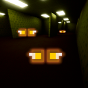
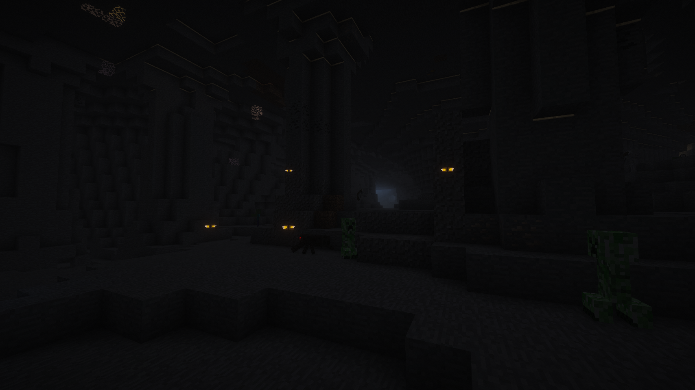

# Eyes in the Shadows mod for Minecraft Forge 1.7.10

The barrier between the world of the living and the world of the dead is already thin in the Minecraft lands.
The days as Halloween draws closer, it weakens down even further.

<!--

-->

If you see the eyes, don't turn away from them.
 
 
Or do, at your own risk.
 
You have been warned.

## Dependencies

* [UniMixins](https://modrinth.com/mod/unimixins)   

## FAQ
### What is this?
It is a backport of the [Eyes in the Darkness](https://github.com/gigaherz/EyesInTheDarkness/blob/master/LICENSE.txt) mod, originally created by [gigaherz](https://github.com/gigaherz).
[Support him on Patreon](https://www.patreon.com/gigaherz).
Please DO NOT report any issues or send any requests concerning this port to gigaherz, open an issue here instead.
 
Original mod showcase by Mischief of Mice: 

 

### Changes from the original
* The eyes are a proper flying entity and not a walking mob.
* Most eye properties are configurable.
* Configurable Eyes attacking tamed Wolves, and vice versa, plus other mobs.
* Configurable Eyes fleeing Ocelots and Cats, and other mobs.
* Implemented configurable aggression changing based on light level.
* Thaumcraft integration (aspects, possibility to warp the player upon jumpscare).
* Eyes can be made entirely passive. Passive eyes can spawn in peaceful mode.
* Configurable dynamic lights support. For technical reasons, it needs to be enabled on server and client.

### Building
`gradlew build`.

## License
`LgplV3 + SNEED`, formerly `BSD 3`.

## Credits
* [GT:NH buildscript](https://github.com/GTNewHorizons/ExampleMod1.7.10).
* [Jabelar](http://jabelarminecraft.blogspot.com/), for his amazing tutorials and mob related code.
* [TheGreyGhost](http://greyminecraftcoder.blogspot.com/p/list-of-topics.html), for superb tutorials as well.

 

